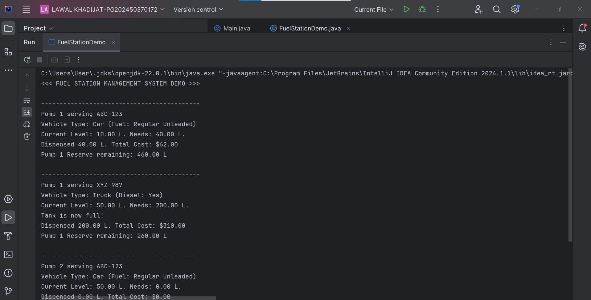

# LAWAL_KHADIJAT_PG202450370172
CSC 825 project demonstrating the four pillars of Object Oriented Programming using Java Programming Language.
To view the source code, navigate to the src folder and then the FuelStationDemo.java file.
To get more explanation on what the code does, navigate to the projectexplanation.md file.
To get the output images of the code when run, navigate to the assets folder and view reult-1 and result-2
Here is a screenshot showing the output

